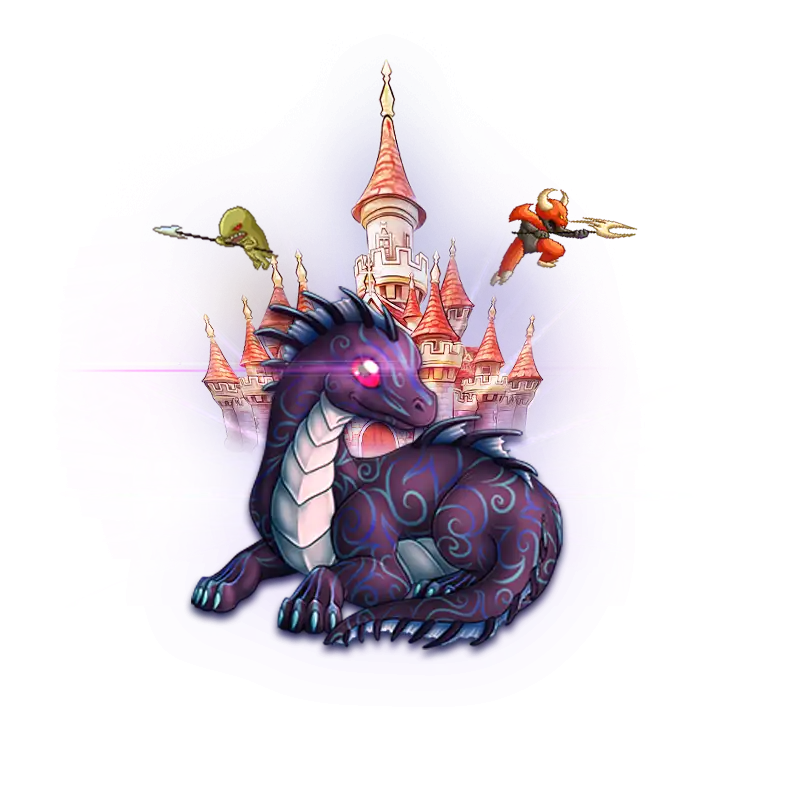
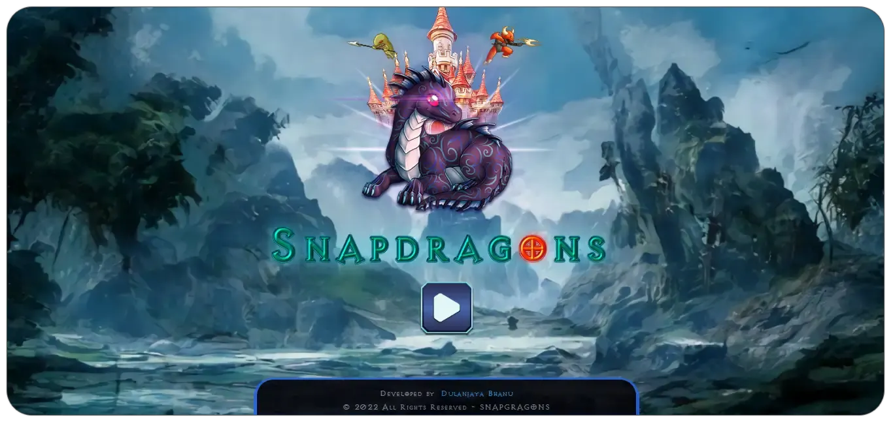
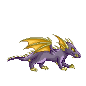
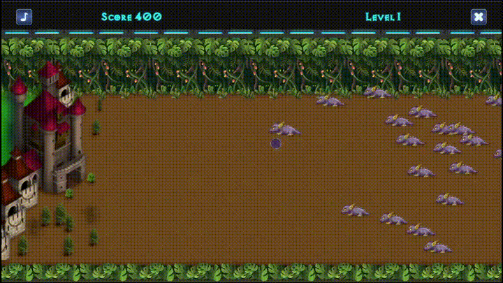

 

  

  

# 🐉 Snap Dragon

Welcome to **Snap Dragon** - a thrilling 2D platformer HTML5 game where you become the valiant protector of a castle! 🏰

## 🌟 Game Overview

In **Snap Dragon**, enemies are approaching to attack your castle. Your mission is to defend it by clicking on the enemies to destroy them. With each level, new and more challenging enemies appear. Do you have what it takes to protect your castle and complete all 4 levels? 🚀

  

## 🎮 How to Play

1. **Objective**: Protect your castle by destroying enemies.
2. **Controls**: Click on the enemies to destroy them.
3. **Levels**: The game has 4 exciting levels, with new enemy types appearing in each level.
4. **Winning**: Successfully defend your castle through all 4 levels to win the game.

## 🚀 Features

- **Easy to Play**: Just click to destroy enemies.
- **Challenging Levels**: Face new enemy types with each level.
- **Exciting Gameplay**: Keep your reflexes sharp and protect your castle.

## ☠️ Enemies

## 🔗 Play the Game Online

Play **Snap Dragon** now by following this link 🤩👉: [Snap Dragon](https://dulanjayabhanu.github.io/SnapDragon/)

## 🛠️ Technologies Used

- **HTML5**
- **CSS**
- **JavaScript**

## 🎮 GamePlay

## 🤝 Contributing

We welcome contributions to improve the game. Feel free to fork the repository and submit pull requests.

## 📄 License

This project is licensed under the MIT License. See the [LICENSE](LICENSE) file for details.

## 📞 Contact

For any inquiries, please contact [My Email](mailto:dulanjayawebs@gmail.com).

---

Enjoy the game and protect your castle! 🏰🔥
